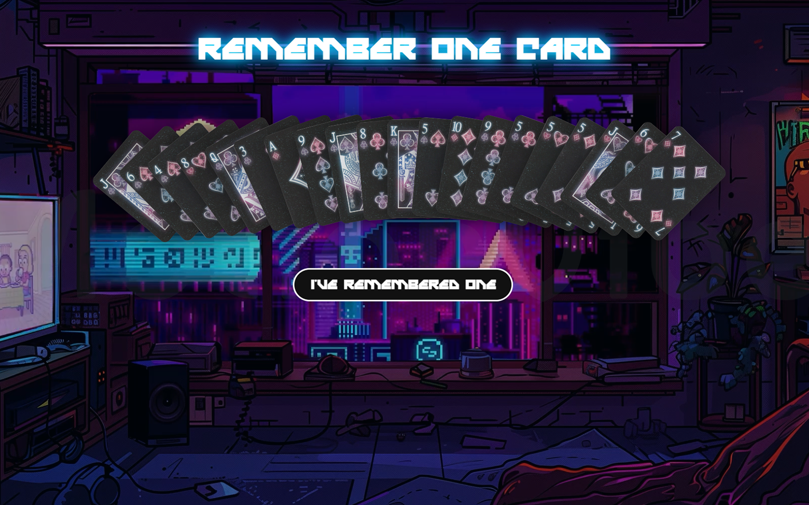
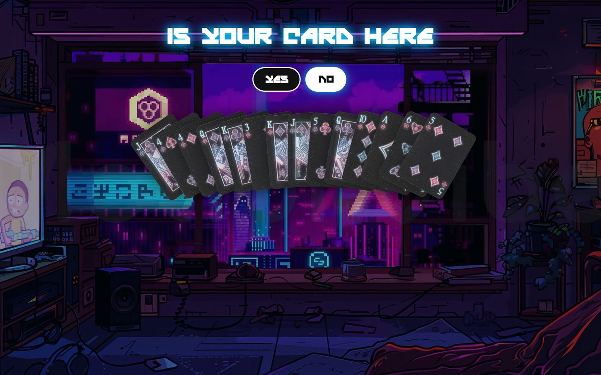
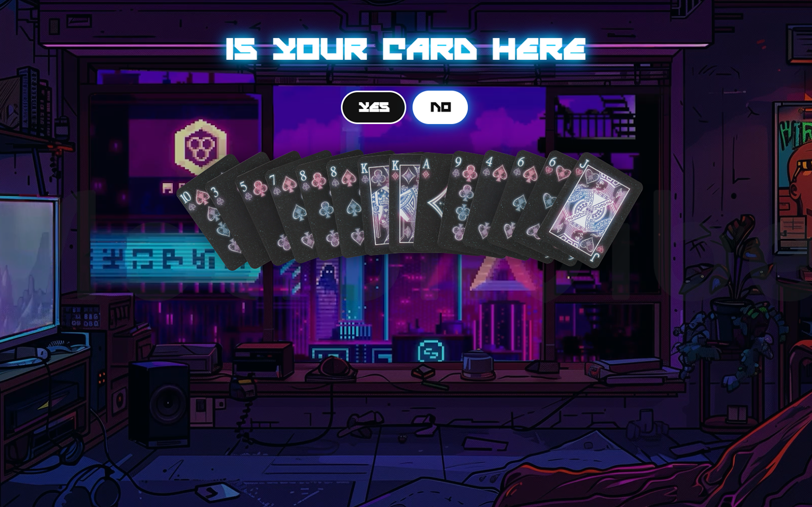
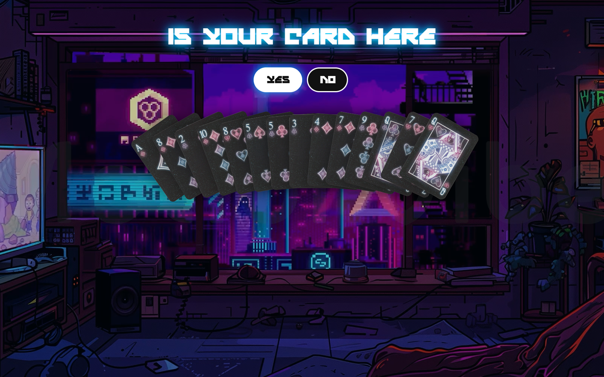
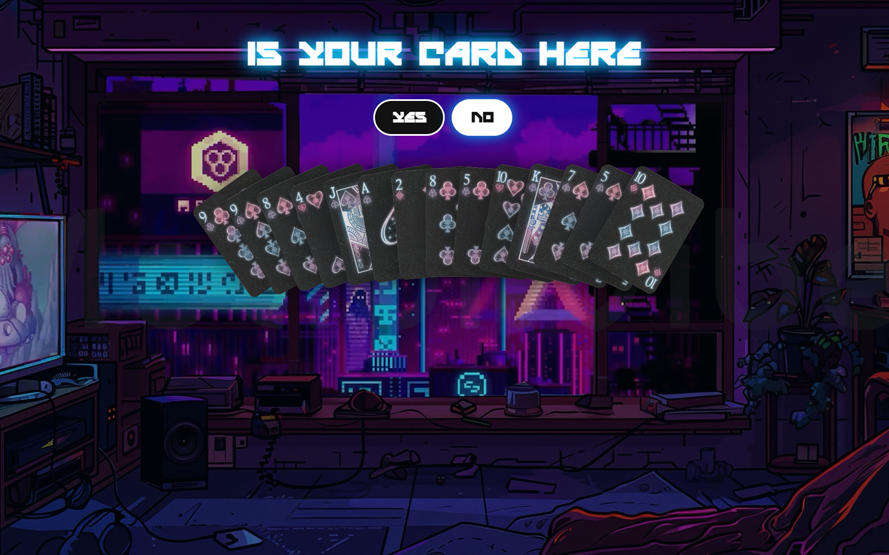
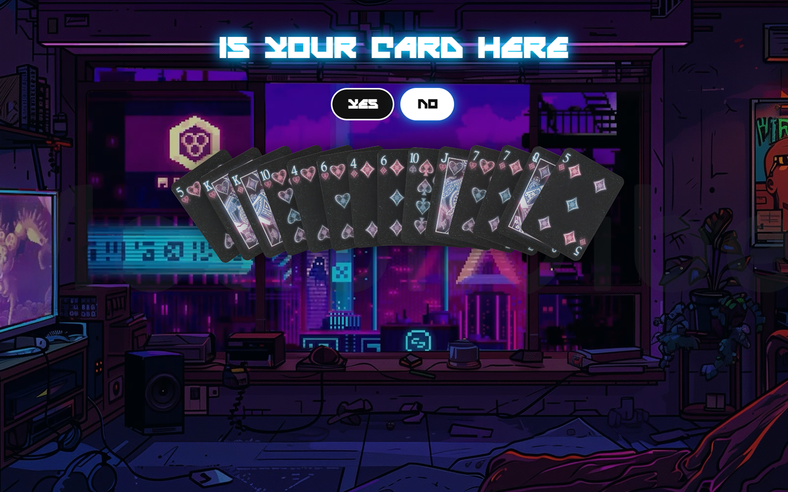
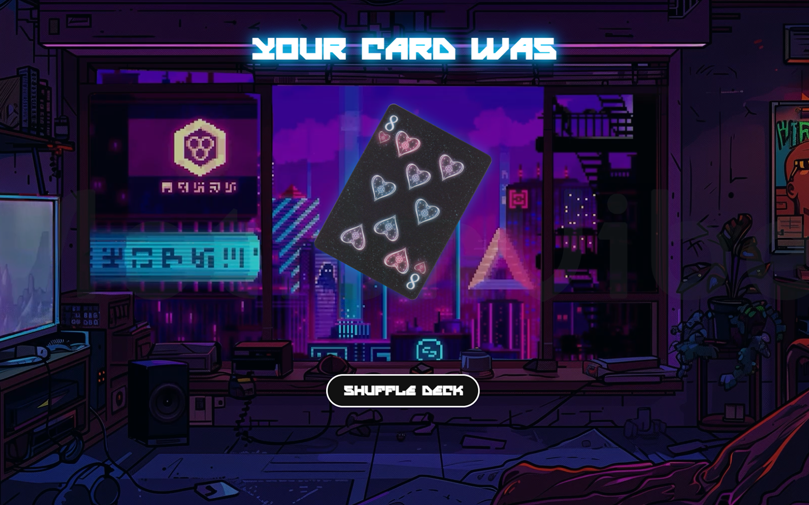

# Glitch in the Card Deck

An interactive front-end illusion where a deck of cards glitches, shuffles, and reorganizes itself to uncover the card you only imagined.
The effect symbolizes the **collision of logic and illusion**, blending binary calculation with cyberpunk visual design to create the feeling of digital sorcery.

Built entirely with **HTML**, **CSS** and **JavaScript**, the project combines classic card mentalism with modern web technologies.
It demonstrates how clever use of **arrays**, **bitwise operations**, and **DOM manipulation** can power an experience that feels more like a futuristic magic trick than a piece of code.


## ✨ Features
- Animated background
- **Bitwise logic** to reconstruct the chosen card from simple yes/no answers
- Dynamic **deck generator** using **arrays** (**no external API required**)
- **Fisher–Yates shuffle** implementation for true randomness each round
- DOM driven **card rendering** with `createElement()` and dynamic attributes
- **Transform based fanning** for realistic card layouts via **CSS + JS**
- **State management** handled in plain JavaScript (no frameworks)
- Responsive **CSS layout** ensuring cards scale across devices
- Entirely built with **HTML**, **CSS**, and **vanilla JavaScript** meaning no libraries and no dependencies

 
## 🎥 Demo

### Card chosen is **8 of Hearts**

<p align="center">
  
  
  
  <br>
  
  
  
  <br>
  
</p>

## 🚀 How to Run

1. Clone this repository:
   ```bash
   git clone https://github.com/Filip-2002/Glitch-In-The-Card-Deck.git

2. Open the project folder.

3. Launch `index.html` in your browser.


